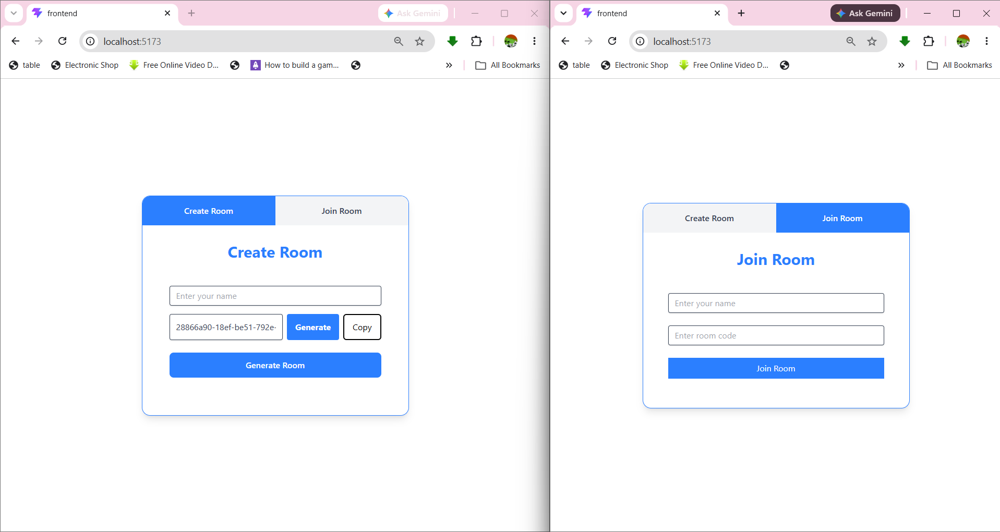
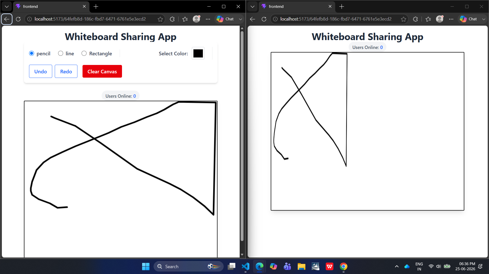
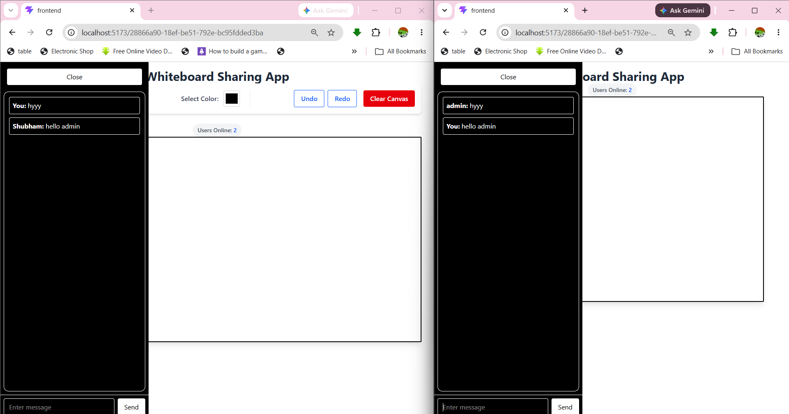
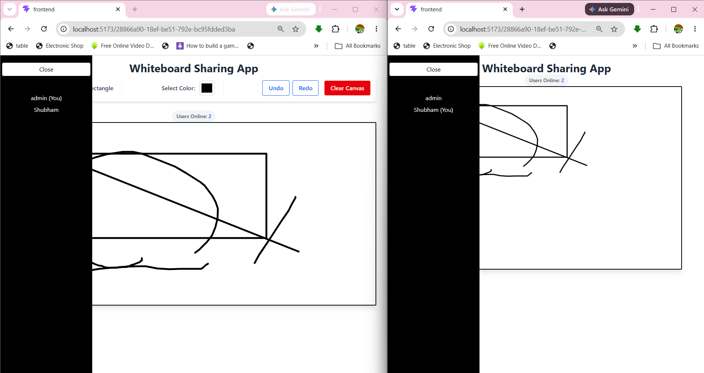

# 🎨 Realtime Whiteboard Sharing App

A full-stack realtime whiteboard application where multiple users can join rooms, draw together, and communicate through live chat.

## 🚀 Features

* Real-time whiteboard drawing
* Room-based collaboration
* Live chat using Socket.IO
* Presenter mode
* Responsive UI
* Drawing tools (Pencil, Rectangle, Line)
* Real-time synchronization

---

## 🛠 Tech Stack

### Frontend

* React
* TypeScript
* Tailwind CSS
* Socket.IO Client

### Backend

* Node.js
* Express.js
* Socket.IO

---

## 📸 Screenshots

### Home



### Whiteboard



### Chat



### Users



---

## 📂 Project Structure

Main/
├── Backend/
├── Frontend/
├── screenshots/
└── README.md

---

## ⚙️ Installation

### Clone Repository

```bash
git clone YOUR_REPOSITORY_URL
cd Main
```

### Start Backend

```bash
cd Backend
npm install
npm run dev
```

### Start Frontend

```bash
cd Frontend
npm install
npm run dev
```

---

## 🔗 Environment Variables

Backend:

```env
PORT=5000
```

Frontend:

```env
VITE_SERVER_URL=http://localhost:5000
```

---

## Future Improvements

* Undo / Redo
* Export Whiteboard
* Authentication
* Mobile Optimization

---

Made with ❤️ by Shubham
